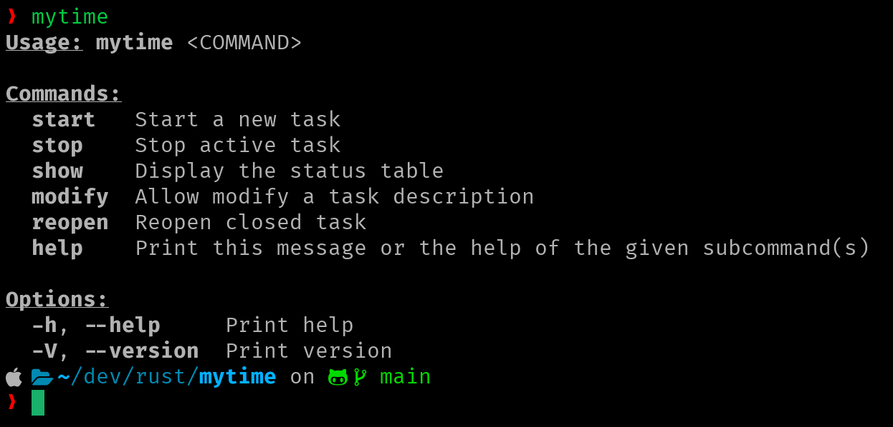
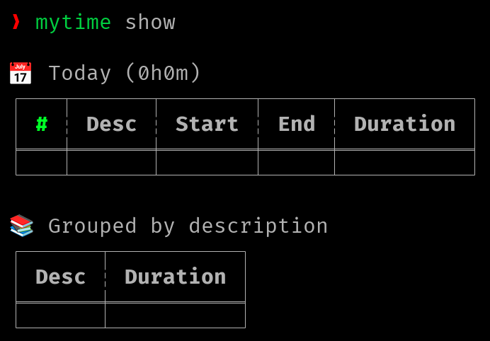
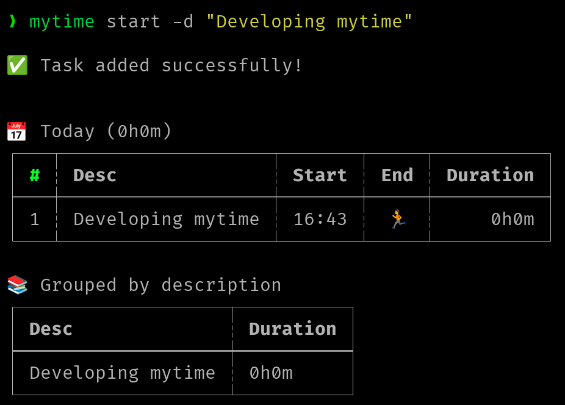

# mytime

This project was created for an educational purpose. Just to learn rust :).

It's used to tracking the working time.


## Usage

Run `mytime` to show the available commands.

Show the tasks table:

```bash
mytime show
mytime show -p today
mytime show --period today
mytime show --period week
mytime show --period month
mytime show -p month

mytime show -r 1
mytime show --relative 1 (1 == -1 == yesterday)

mytime show -d "2023-05-30"
mytime show --date "2023-05-30"
```

Start a new task:

```bash
mytime start --desc "My task"
mytime start -d "My task"
```

Stop the current active task:

```bash
mytime stop
```

Modify the description of a task:

```bash
mytime modify --id 14 --desc "New description"
mytime modify -i 14 -d "New description"
```

Reopen a closed task:

```bash
mytime reopen --id 12
mytime reopen -i 12
```

## Database

The first time `mytime` is executed, it creates the folder `$HOME/.local/share/mytime`. It contains a `sqlite3` database (`mytime.db`) to store data.

## Configure

You can use your own configuration (ini) file and define where store the database.

```bash
touch $HOME/.mytime
```

```ini
[general]
db_folder = /Users/foo/Library/CloudStorage/Dropbox/mytime

```

## Compile code

Download the source code:

```
git clone git@github.com:francescarpi/mytime.git
```

Run for debug:

```
cd mytime
cargo run
```

Compile for production:

```
cargo build --release
```

The binary file will be into the `target` folder.


## Screenshots







## TODO

* New: Store the app version into the database to migrate it for new versions
* New: Add a new column to set if the task has been reported
