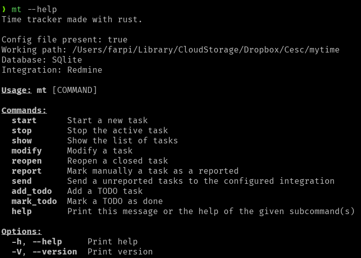

# mytime

This project was created for educational purposes, solely to learn Rust :).

It's used for tracking working time.

## Usage

Execute `mytime --help` to display the available commands.

Each argument has its own short version. For example:

```
mytime show --period today
mytime show -p today
```

In the following examples, we will use the long version.

To show the tasks table:

```bash
mytime show
mytime show --period today
mytime show --period week
mytime show --period month

mytime show --relative 1  # (1 == -1 == yesterday)
mytime show --relative 2  # (day before yesterday)

mytime show --date "2023-05-30"
```

To start a new task:

```bash
mytime start --desc "My task" --project "Project 1"
mytime start --desc "My task" --project "Project 1" --external_id "12345"
```

To stop the currently active task:

```bash
mytime stop
```

To modify a task:

```bash
mytime modify --id 14 --desc "New description"
mytime modify --id 14 --external_id "12345"
mytime modify --id 14 --project "Project 2"
```

To reopen a closed task:

```bash
mytime reopen --id 12
```

To toggle the reported flag, indicating that the task has been reported to your own tracking tool, such as Redmine or Jira:

```bash
mytime report --id 12
```

To send unreported tasks to Redmine:

```bash
mytime send
```

To add an item into the TODO list:

```bash
mytime add-todo --project "FOO" --desc "Pending task 1"
```

Mark a TODO task as done:

```bash
mytime mark-todo --id 1
```

Create a task from a TODO:

```bash
mytime todo-to-task --id 1
```

## Database

By default, the `sqlite3` database is created at `$HOME/.local/share/mytime`. You can change the default path through the config file.

## Config File

The config file is in `ini` format.

```bash
touch $HOME/.mytime
```

```ini
[general]
db_folder = /Users/foo/Library/CloudStorage/Dropbox/mytime
db = sqlite
integration = redmine

[redmine]
url = <YOUR_REDMINE_DOMAIN>
token = <YOUR_TOKEN>
```

## Build Sources

Download the source code:

```
git clone git@github.com:francescarpi/mytime.git
```

Run for debugging:

```
cd mytime
cargo run
```

For production:

```
cargo build --release
```

The binary file will be located in the `target` folder.

## Screenshots




